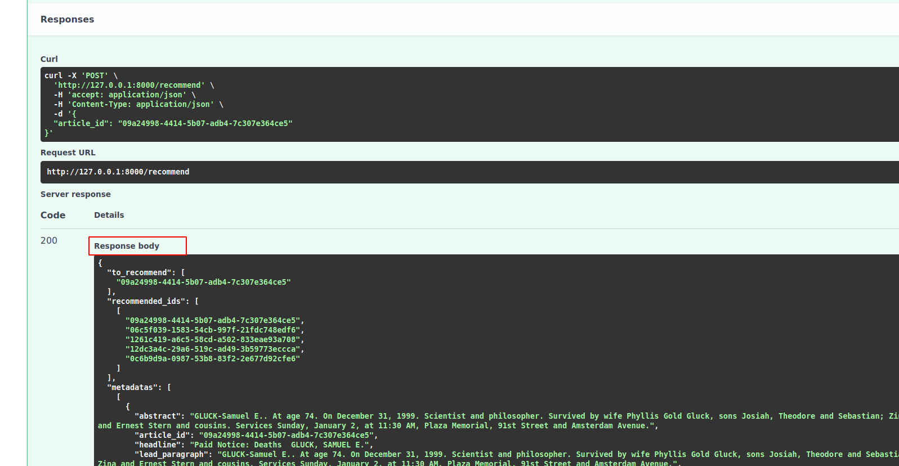

# LLM-Powered Semantic Media Recommendation Engine

## Project Overview

The LLM-Powered Semantic Media Recommendation Engine is designed to provide highly relevant article recommendations within a media context. Leveraging state-of-the-art language models and semantic understanding, this recommendation engine aims to enhance the reader's experience by suggesting articles that are contextually meaningful and interesting.

## Features

- **Semantic Article Recommendations:** Utilizes semantic understanding to recommend articles that share similar meanings and themes.
- **Data Source:** Sources article data from The New York Times for a diverse and high-quality content selection.
- **Vector Database:** Indexes the article data on the vector database (Chromadb) for efficient retrieval and recommendation.
- **Google PALM2 Text Embedding:** Generates article embeddings using Google's PALM2 model for accurate semantic representation.
- **API Integration:** Provides a user-friendly API for recommending similar articles based on the meaning and context of the content.

## Technologies Used

- **Language Model:** Utilizes the Large Language Model (LLM) for semantic analysis.
- **Data Source:** The New York Times API for acquiring article data.
- **Vector Database:** Chromadb for efficient data indexing and retrieval.
- **Text Embedding:** Google PALM2 for creating meaningful text embeddings.
- **API Framework:** [Specify the API framework or technology used for your recommendation API].
- **Text Embedding Model:** embedding-gecko-002 (or embedding-gecko-001)
  - **Model Last Updated:** August 2023
  - **Model Size:** Gecko
  - **Model Capabilities:**
    - Generates text embeddings for the input text.
    - Optimized for creating embeddings for text of up to 1024 tokens.
  - **Model Safety:** No adjustable safety settings.
  - **Rate Limit during Preview:** 1500 requests per minute

## Installation

To set up and run the project, follow these steps:

### Step 1: Create Virtual Environment and Install Necessary Packages

```bash
python3 -m venv .env
source .env/bin/activate
pip3 install -r requirements.txt
```

### Step 2: Index Data (Adjust data path and metadata)
Please change the data path and metadata according to your use case.

```bash
python3 create_vector_db.py
```

### Step 3: Deploy API

```
uvicron api:app --reload
```

### Step 4: Open Swagger UI

http://127.0.0.1:8000/docs

## Step 5: Provide the article_id and click on Execute

Input:


Response:


